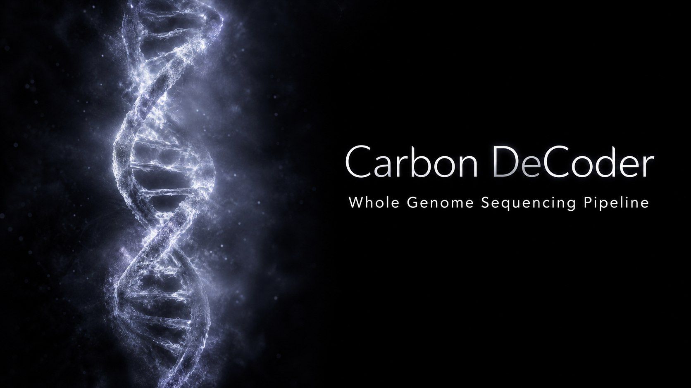
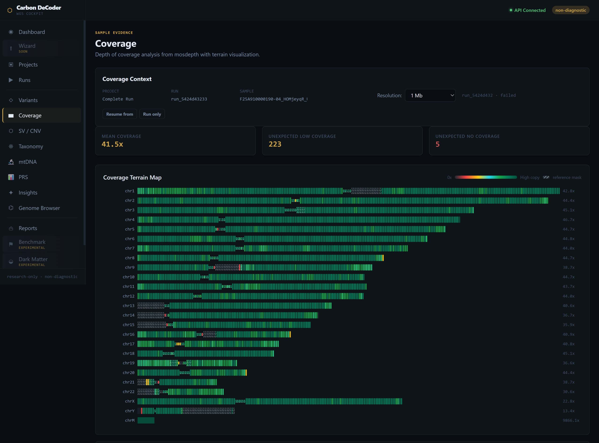

# Carbon DeCoder



Carbon DeCoder is a local-first, research-only whole genome sequencing cockpit for running, inspecting, and recovering WGS workflows on owned infrastructure.

> Research only / non-diagnostic. Carbon DeCoder does not provide medical diagnosis, clinical recommendations, or automatic pathogenicity conclusions. Human review, provenance checks, and independent validation remain required.

## Licence

Carbon DeCoder is licensed under `AGPL-3.0-or-later`. See `LICENSE` for the full licence text and `LICENCES.md` for third-party backend, pipeline, runtime, frontend, and reference-data notices.

## Current Baseline

- project, sample, run, reference, data import, and report bundle APIs
- Postgres-backed runtime metadata
- FASTQ and prepared BAM input paths
- alignment with `minimap2`, `bwa`, or `bwa-mem2`
- coverage with `mosdepth`
- SNV/indel calling with `bcftools`
- live alignment telemetry from SAM stdout
- pause, resume, cancel, retry, skip, stage-scoped resume, and delete controls
- optional Redis-backed worker queue
- IGV.js genome browser with BAM/VCF/coverage discovery
- Fast ClinVar Screening from run-scoped BAM-screen artifacts before full variant calling is ready

## Interface Preview



## Still Gated

- full ClinVar annotation over complete variant calls
- broad SV/CNV validation
- mtDNA, PGx, PRS, traits, and haplogroup interpretation modules
- clinical or diagnostic reporting

## Repository Layout

```text
apps/api/          FastAPI backend, persistence, parsers, pipeline orchestration
apps/frontend/     Next.js cockpit UI
docs/              Current product flow model
pipelines/         Nextflow and stage scripts
references/        Reference manifests and reference helper scripts
schemas/           OpenAPI, event, result, and DB schemas
scripts/           Runtime, smoke, deploy, and validation helpers
```

`docs/APP_FLOW_MODEL.md` is the only retained design document in this public-clean branch.

## Quick Start

Requirements:

- Docker Engine or Docker Desktop
- Docker Compose V2
- Git
- 8 GB+ RAM for small tests
- 32 GB+ RAM and substantial disk for real WGS work

Start locally:

```bash
git clone <repo-url>
cd wgs-cockpit
cp .env.example .env
docker compose up -d --build
```

Open:

```text
Frontend: http://localhost:3000
API:      http://localhost:8000
Swagger:  http://localhost:8000/docs
```

Never use `docker compose down -v` or `docker volume prune` for routine maintenance. Those commands can delete named volumes containing results, Postgres state, references, or runtime data.

## Remote Deploy

Remote deployments use SSH as the control layer: update the checkout on the remote host, then build on that host. Transferring Docker images from another machine is an emergency fallback only.

```bash
git pull origin main
docker compose -f docker-compose.yml -f docker-compose.remote.yml up -d --build api frontend worker
```

The remote overlay binds host data directories into the containers:

- host input directory -> `/data/input`
- host references directory -> `/data/references`
- host taxonomy database directory -> `/data/databases/kraken2`

The default `/data/results` path remains the named Docker volume unless the deployment explicitly overrides it.

Keep local deployment secrets in `.env` or `.env.remote`. Only `.env.example` belongs in Git.

## Pipeline Stages

| Stage | Main tools | Status |
| --- | --- | --- |
| Input validation | API preflight | working |
| Alignment | minimap2, bwa, bwa-mem2, samtools | working |
| Coverage | mosdepth | working |
| SNV/indel | bcftools | working |
| SV/CNV | Manta, Delly, CNVkit | needs wider validation |
| Taxonomy | Kraken2, Bracken optional | smoke-verified |
| mtDNA | GATK Mutect2 | scaffold |
| PRS | pgsc_calc | gated |
| Reports | HTML, JSON, Parquet, manifests | framework working |

## Fast ClinVar Screening

Fast ClinVar Screening is a targeted BAM-screening path. It is useful after alignment and before full variant calling finishes.

Current behavior:

- screens a strict high-confidence ClinVar P/LP target set
- reads run-scoped artifacts under `/data/results/{run_id}/clinvar_fast_screen`
- reports exact ClinVar allele matches separately from raw variant calls
- displays raw genotype evidence such as `GT`, `DP`, `AD`, `DP4`, `MQ`, and `QUAL`

Important limits:

- it is a screening and triage path, not a clinical negative result
- it does not replace full variant calling plus normalized ClinVar annotation
- position-only matches are intentionally rejected when alleles differ

## Validation

Useful checks:

```bash
make lint
./scripts/run_tests.sh
docker compose config -q
docker compose -f docker-compose.yml -f docker-compose.remote.yml config -q
```

Frontend-only build:

```bash
cd apps/frontend
npm ci
npm run build
```
